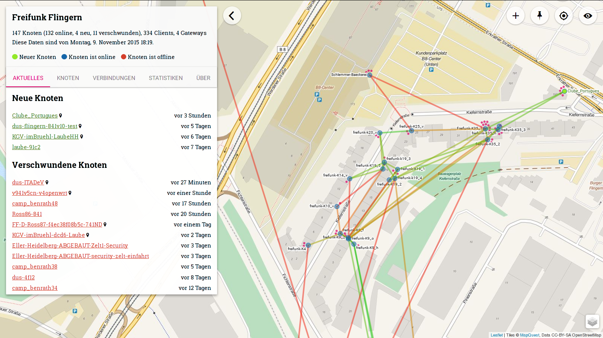
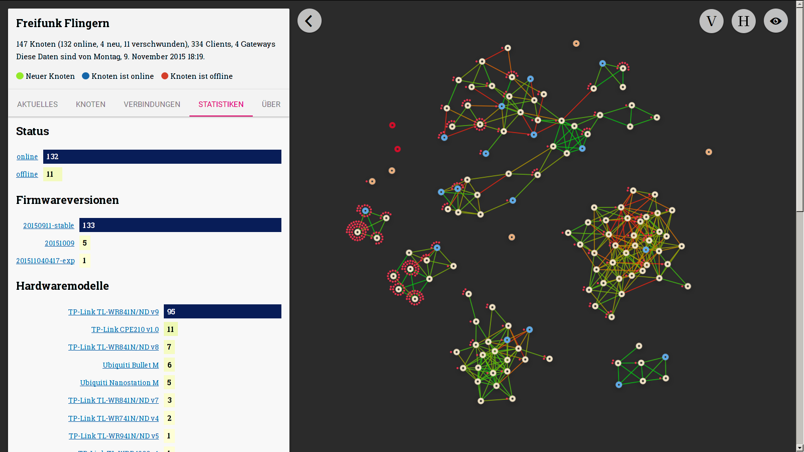
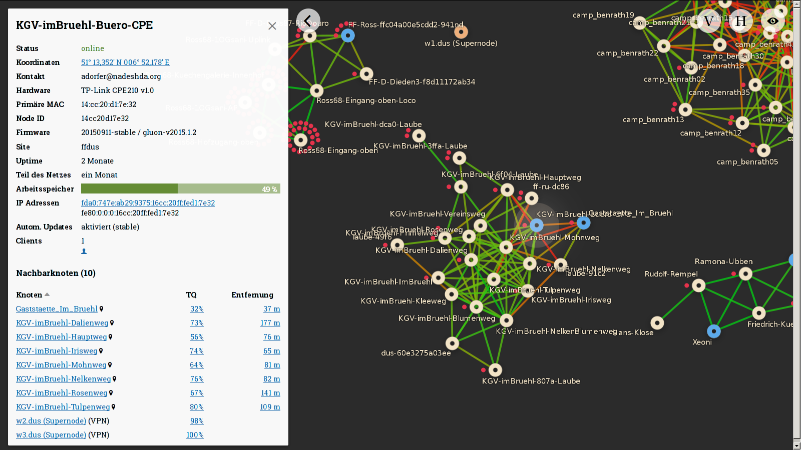

# Meshviewer

Meshviewer is a frontend for
[ffmap-backend](https://github.com/ffnord/ffmap-backend).

[Changelog](CHANGELOG.md)

# Screenshots

# Configuration

Copy `config.json.example` to `build/config.json` and change it to match your community.

## dataPath (array / string, optional)

`dataPath` must contain one or more strings pointing to a directory containing
`nodes.json` and `graph.json` (both are generated by
[ffmap-backend](https://github.com/ffnord/ffmap-backend)). Don't forget the
trailing slash! Data may be served from a different domain with [CORS enabled].
Also, GZip will greatly reduce bandwidth consumption.

## siteName (string)

Change this to match your communities' name. It will be used in various places.

## mapSigmaScale (float)

This affects the initial scale of the map. Greater values will show a larger
area. Values like 1.0 and 0.5 might be good choices.

## showContact (bool)

Setting this to `false` will hide contact information for nodes.

## maxAge (integer)

Nodes being online for less than maxAge days are considered "new". Likewise,
nodes being offline for less than than maxAge days are considered "lost".

## mapLayers (List)

A list of objects describing map layers. Each object has at least `name`
property and optionally `url` and `config` properties. If no `url` is supplied
`name` is assumed to name a
[Leaflet-provider](http://leaflet-extras.github.io/leaflet-providers/preview/).

## nodeInfos (array, optional)

This option allows to show client statistics depending on following case-sensitive parameters:

- `name` caption of statistics segment in infobox
- `href` absolute or relative URL to statistics image
- `thumbnail` absolute or relative URL to thumbnail image,
  can be the same like `href`
- `caption` is shown, if `thumbnail` is not present (no thumbnail in infobox)

To insert current node-id in either `href`, `thumbnail` or `caption`
you can use the case-sensitive template string `{NODE_ID}`.

Examples for `nodeInfos`:

    "nodeInfos": [
      { "name": "Clientstatistik",
        "href": "nodes/{NODE_ID}.png",
        "thumbnail": "nodes/{NODE_ID}.png",
        "caption": "Knoten {NODE_ID}"
      },
      { "name": "Uptime",
        "href": "nodes_uptime/{NODE_ID}.png",
        "thumbnail": "nodes_uptime/{NODE_ID}.png",
        "caption": "Knoten {NODE_ID}"
      }
    ]

In order to have statistics images available, you have to run the backend with parameter `--with-rrd` or generate them in other ways.

## globalInfos (array, optional)

This option allows to show global statistics on statistics page depending on following case-sensitive parameters:

- `name` caption of statistics segment in infobox
- `href` absolute or relative URL to statistics image
- `thumbnail` absolute or relative URL to thumbnail image,
  can be the same like `href`
- `caption` is shown, if `thumbnail` is not present (no thumbnail in infobox)

In contrast to `nodeInfos` there is no template substitution in  `href`, `thumbnail` or `caption`.

Examples for `globalInfos`:

    "globalInfos": [
      { "name": "Wochenstatistik",
        "href": "nodes/globalGraph.png",
        "thumbnail": "nodes/globalGraph.png",
        "caption": "Bild mit Wochenstatistik"
      },
      { "name": "Jahresstatistik",
        "href": "nodes/globalGraph52.png",
        "thumbnail": "nodes/globalGraph52.png",
        "caption": "Bild mit Jahresstatistik"
      }
    ]

In order to have global statistics available, you have to run the backend with parameter `--with-rrd` (this only creates globalGraph.png) or generate them in other ways.

## Colors and Radius for Nodes

In `lib/map.js` you can change the colors and radius for nodes in different states:

- iconNew: Nodes that are online for less than maxAge days (default: green, radius: 6)
- iconOnline: online for more than `maxAge` days (default blue, radius: 6)
- iconAlert: nodes offline less than 8 Hours (default: blinking red, radius: 5)
- iconLost: nodes being offline for less than than `maxAge` days (default: grey, radius: 5)
- iconOffline: offline for more than `maxAge` days up to the maximum prune time of the backend (default: grey, radius: 3)

## siteNames (array, optional)

In this array name definitions for site statistics and node info can be saved. This requires one object for each site code. This object must contain:

- `site` the site code
- `name` the defined written name for this site code
- `link` an http address to the community website (optional)

If neither `siteNames` nor `showSites` are set, site statistics and node info won't be displayed

Example for `siteNames`:

    "siteNames": [
      { "site": "ffgt", "name": "Gothamcity", "link" : "https://gotham.city" },
      { "site": "ffal", "name": "Atlantis" }
    ]

# Building a minimized version

Consider using a [precompiled tarball](http://petabyteboy.de:8090/job/plumpudding-meshviewer/lastSuccessfulBuild/artifact/build.zip) of the latest and greatest master commit

## Build dependencies

- npm
- bower
- grunt-cli
- Sass (>= 3.2)

## Installing dependencies

Install npm and Sass with your package-manager. On Debian-like systems run:

    sudo apt-get install git npm nodejs-legacy ruby-sass

or if you have bundler you can install ruby-sass simply via `bundle install`

Execute these commands on your server as a normal user to prepare the dependencies:

    git clone https://github.com/ffnord/meshviewer.git
    cd meshviewer
    npm install
    npm install grunt-cli

## Building

Just run the following command from the meshviewer directory:

    node_modules/.bin/grunt

This will generate `build/` containing all required files.

# Deploy

Place your config.json in the `build/` directory. Now just copy `build/` into your servers document-home (e.g. /var/www/meshviewer/ or /srv/http/meshviewer/).

# Contribution Policy

Contributions are generally welcome. Please make sure your request meets all the following criteria:

- The changes don't drastically decrease performance and are implemented with weak clients (such as smartphones) in mind.
- It is impossible to archieve the same result without the changes. Simplifications of existing features are not likely to be accepted.
- The code is not overcomplicated and uses a style similar to other parts of the codebase.

If you really want a feature don't be afraid to ask. We will make a decision for the individual case or find a reasonable compromise.

If you modify the source be sure to update the links in lib/about.js to match your modified version. 

[CORS enabled]: http://enable-cors.org/server.html
